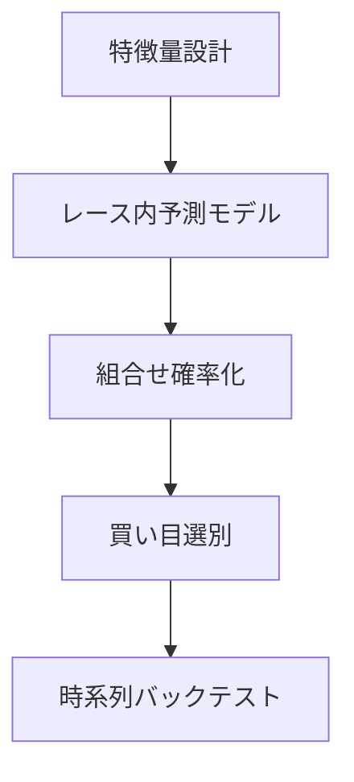

# データ分析型競馬予想の調査（的中寄り）

調査目的: ネット上でデータ分析により結果を出している人・研究の手法を整理し、**的中確率の高いレースだけに絞って堅く買う**運用と、**レースの質に応じて券種を変える**設計に落とし込む。

対象方針（本リポジトリの採用方針）:

- 主指標は **的中率**（回収率は副次監視）
- **全レースは買わない**。的中確率が高いレースだけに投資する
- 券種は固定しない。レース構造（堅実 / 中荒れ / 大荒れ）とコース特性で切り替える
- **オッズが低すぎる買い目・レースはケン（見送り）**
- 印（◎◯▲△）の生成精度と、券種・配分はレイヤを分ける

---

## 1. 結論サマリ

精度を上げる最短ルートは次の4点である。

1. **特徴量の相対化**（同レース・同条件での偏差値化。絶対タイムだけ見ない）
2. **レース内ランキング**（race-wise。sample-wiseの「強い馬」判定で終わらない）
3. **展開・コース条件**（逃げ密度・枠・馬場。印と券種の材料にする）
4. **リーク防止**（当該走の確定タイム・確定オッズを学習特徴に入れない）

運用に落とすと、共通手順はこうなる。

1. **レース選別**が先（勝てそうなレースだけ残す）
2. **レース内の相対評価**で上位馬を出す
3. **上位の確信度とレース構造**から券種を決める（三連単固定にしない）
4. 選んだレースでは **点数を抑え、配分を厚くする（堅く買う）**

データ分析で結果を出している側の層構造:



ご友人の「買い目を絞って三連単で +50万」は、単発の再現性証明にはならないが、成功パターンとしては **(A) 軸が明確なレースを選んだ (B) 相手を絞った (C) 並びまで読めた** の三点が揃ったケースと解釈するのが妥当である。

的中寄り運用では、三連単を常時狙うより、まず **堅実レースでワイド・馬連・三連複を高的中で積む** 方が再現性が高い。三連単は「上位が抜けている & 並びまでモデルが自信を持つレース」に限定する。

### 1.1 ケース: 2026年 神戸新聞杯（ご友人の +50万レース）

出典: [JRA結果](https://www.jra.go.jp/datafile/seiseki/replay/2026/088.html) / [netkeiba](https://race.netkeiba.com/race/result.html?race_id=202609040711)（2026-09-21 阪神11R 芝2400m 外・良・11頭）

| 着 | 馬番 | 馬名 | 人気 | 単勝 | 通過 | 上がり |
| --- | --- | --- | --- | --- | --- | --- |
| 1 | 1 | ロブチェン | 1 | 1.4 | 5-7-8-4 | 33.8 |
| 2 | 4 | アルトラムス | 3 | 9.6 | 8-10-9-8 | 33.5 |
| 3 | 8 | シートゥサミット | 11 | 113.7 | 10-8-1-1 | 34.1 |

払戻の要点:

- 三連単 `1-4-8` = **33,530円**（106番人気）
- 三連複 `1-4-8` = 14,410円 / 馬連 `1-4` = 590円 / ワイド `1-4` = 280円
- 2番人気グリーンエナジー（8.9倍）は8着。人気サイドの「相手」は崩れている

+50万の規模感（概算）:

- 的中1点に **1,500円** 載せると払戻 ≈ 33,530 × 15 = **約50.3万円**（投資が少点数なら利益も同規模）
- つまり「ドンピシャ」は **少点数フォーメーションの中に 1-4-8 を残し、その点に厚く載せた** 形と整合する

このレースの構造ラベル（本方針での分類）:

```text
軸: 極めて堅い（2冠馬・単勝1.4倍）
2着候補: 中穴まで散らばる余地あり
3着: 大荒れ（最低人気が逃げ粘り）
→ 「軸堅・下位荒れ」型（丸ごと堅実レースではない）
```

データ分析勢が当てたポイントの推定:

1. **軸は市場と同じ**（ロブチェン1着）→ 的中寄りの第一条件を満たす
2. **相手から人気薄を1頭残した**（シートゥサミット）→ 展開・適性・データで市場と差分を取った
3. **券種を三連単に上げた** → ワイド1-4だけでは +50万は不可能。穴の3着を順位つきで取りに行った

本方針への教訓:

| 学び | 運用への反映 |
| --- | --- |
| 「堅実」を人気どおり着順と同一視しない | スコアは **軸の堅さ (`axis_solid`)** と **下位の荒れやすさ (`field_chaos`)** を分ける |
| 軸堅・下位荒れは三連単の主戦場になりうる | 券種マトリクスに専用行を追加（下記4.2） |
| それでも再現性は低い | 的中本線は依然ワイド/馬連。三連単は **軸Highかつ穴候補にデータ根拠があるときだけ** |
| 見送り判定を誤ると取りこぼす | 「大荒れだからSkip」ではなく「軸が無い荒れ」だけ Skip |

---

## 2. 成功している人・研究の予想の仕方

### 2.1 全体パイプライン

```text
データ整備
  → 特徴量（能力・展開・血統・人・条件）
  → レース内スコアリング（Ranker / 複勝確率）
  → レース構造スコア（堅実度）
  → Pass/Skip（買うレースだけ残す）
  → 券種選択（レース質 × コース特性）
  → 買い目生成（軸流し / フォーメーション / 少数BOX）
  → 時系列バックテスト（的中率・標準偏差）
```

### 2.2 問題設定（当てるための定石）

| アプローチ | 内容 | 的中寄りの使い方 |
| --- | --- | --- |
| レース内ランキング | LightGBM `lambdarank` 等で同レース内順位を最適化 | 印付け・上位候補抽出の本線 |
| 複勝二値分類 | 3着以内確率 | 相手候補のフィルタ、ワイド/三連複向き |
| 1着二値分類 | 勝つ確率 | 軸（◎）の確信度 |
| 組合せ確率化 | Harville 等で 1-2-3 確率 | 三連単・馬単を出すときだけ |

重要点（AlphaImpact 等で繰り返し強調される）:

- **sample-wise（この馬は強いか）ではなく race-wise（このレースで誰が上か）**
- 評価は「予測上位 N 頭」の的中率を、**単勝人気トップ N** と比較する
- 確定オッズを特徴に入れると的中は上がりやすいが、人気追随になりやすい。的中寄りでも **オッズは特徴に入れるか、人気ベースライン比較用に分けるか** を明示する

### 2.3 特徴量カタログ（優先度付き）

| 優先 | カテゴリ | 典型例 |
| --- | --- | --- |
| まず入れる | 能力指数 | スピード指数（西田式等）、標準化タイム、上がり3F、着差 |
| まず入れる | 相対化 | レース内偏差値化、同条件（距離×芝ダート×競馬場）での比較 |
| まず入れる | 時系列 | 直近N走平均・最良（**当該レースは shift(1) で除外**） |
| まず入れる | 人・負担 | 騎手・調教師の複勝率（条件別）、斤量、休み明け、距離変化 |
| 次に入れる | 展開 | 逃げ確率、先行密度、脚質分布、枠・騎手傾向、馬場バイアス |
| 次に入れる | 血統 | 父/母父の距離・芝ダート別成績 |
| 後回し | 高度化 | 合成オッズ、深層時系列単独、回収専用ラベルの単独最適化 |

データ要件の詳細チェックリストは
[required-data-for-selection.md](required-data-for-selection.md) を正とする。

出典の代表:

- [競馬予想AIの特徴量一覧（ランキング学習）](https://www.issoh.co.jp/tech/details/2321/)
- [西田式スピード指数の実装例](https://note.com/kyoutei_net/n/nede0dbc39e88)
- [展開特徴の試行](https://qiita.com/Fujita_Kousuke/items/ed98ae4e7a104560e883)
- [AlphaImpact 第7回（race-wise 評価）](https://alphaimpact.co.jp/2017/03/02/classification-and-regression/)
- [慶應・機械学習とオッズ歪み](http://user.keio.ac.jp/~nagakura/mitaronsotsuron/mitaron2020b.pdf)

### 2.4 成功者パターン比較: 的中型 / 回収型 / オッズ歪み型

| | 的中型 | 回収型 | オッズ歪み型 |
| --- | --- | --- | --- |
| 目的 | 当たる確率を上げる | 長期で資金を増やす | 市場の割安だけ買う |
| レース | 堅実・軸ありを選ぶ | 歪みがあるレースも買う | 単勝から理論組合せを作り実オッズと比較 |
| モデル | Ranker / 複勝・1着確率 | 穴ラベルや期待値最適化 | 支持率→理論確率（Harville系） |
| 買い方 | 少点数・軸流し | EV>閾値の点 | 理論より厚い実オッズ |
| 失敗 | 低配当の厚買い | 的中崩壊 | 控除に負ける・N不足 |
| 本方針 | **主** | 副（床/EVで取り込む） | 後回し（合成オッズ以降） |

本方針は的中型を主とし、回収は `odds_floor` / EV ゲートで副次的に担保する。  
ご友人の三連単一発は見た目は回収型だが、中身は **絞ったレースで並びまで当てた的中型** に近い。

---

## 3. レース選別: 的中確率が高いレースだけ買う

### 3.1 何を「堅実レース」と呼ぶか

実務・個人分析で使われている見極めは、次の合成である。

1. **能力分布が偏っている**  
   上位1〜2頭のスコアが3位以下から大きく離れている（抜けた軸がある）
2. **指数順位と人気順位が近い**  
   コンピ / マイニング / 自前スコアの上位と人気が一致 → 手堅い  
   バラバラ → 荒れ候補（的中方針では Skip しやすい）
3. **出走頭数が多すぎない**  
   頭数が多いほど組合せ爆発と展開ノイズが増える
4. **コース・条件が読みやすい**  
   直線が長く差し決着が安定、または逃げ残りが統計的に安定、など「型」がある条件
5. **新馬・情報不足レースを避ける**  
   データ分析勢は情報量の薄いレースを捨てることが多い

### 3.2 推奨する RaceQuality スコア（実装イメージ）

各レースに **軸の堅さ** と **下位の荒れやすさ** を分けて付ける。閾値は軸側で Pass/Skip を決める。

```text
axis_solid   = 1着候補の突出度（自前1位確率・人気集中）
field_chaos  = 2〜3着のばらつき（人気と指数の不一致、先行密度など）
race_pass    = axis_solid が閾値以上なら Pass（軸が無い荒れは Skip）
```

運用ルール（的中寄り）:

- `axis_solid = High` かつ `field_chaos = Low`: **堅実本線**（ワイド/馬連厚め）
- `axis_solid = High` かつ `field_chaos = High`: **軸堅・下位荒れ**（本線は軸絡みワイド。三連単は穴根拠があるときだけ）
- `axis_solid = Mid`: ワイド軽め、または見送り
- `axis_solid = Low`: **必ず見送り**

「ケンをしっかり」= 残したレースに予算を寄せ、薄い点数で広く撒かない。  
加えて **オッズが低すぎる本線はケン**（券種別 `odds_floor`。詳細は [tipster-pattern-mapping.md](tipster-pattern-mapping.md) §4.1.1）。

### 3.3 荒れるレースの扱い

荒れるレースの見分け（競馬場特性・指数と人気の乖離など）はネット上でも多いが、**的中寄りでは基本スキップ**が正解である。荒らし狙いは回収・一発型の仕事。

例外: モデルが「上位は堅いが3着だけばらける」と明示できるときのみ、ワイド/三連複で相手をやや広げる（三連単は避ける）。

---

## 4. 券種は絞らず、レースの質で変える

### 4.1 原則

- 券種を「いつもワイド」「いつも三連単」に固定しない
- **レース構造 × コース特性 × 上位確信度** で券種マトリクスを選ぶ
- 点数は同額予算を点数で割る（1レース投資上限を先に決める）

これは既存の Logic Horse 方針（直線長コースは少点数、小回りは広め、条件で券種固定しない）と整合する。

### 4.2 券種マトリクス（推奨）

| レース構造 | コース傾向 | 推奨券種 | 買い方の型 | 備考 |
| --- | --- | --- | --- | --- |
| 堅実（抜けた軸） | 直線長・少頭数 | 馬連 / 馬単 / 三連複少点 | 軸1頭＋相手2〜3 | 三連単は並び自信があるときのみ |
| 堅実 | 小回り・枠有利強 | ワイド / 馬連 | 軸＋相手やや広め | 枠・脚質で相手を切る |
| **軸堅・下位荒れ** | 問わず（長距離試し等） | **本線ワイド/馬連＋条件付き三連単** | 軸固定。相手にデータ根拠のある穴を1頭だけ残す | **2026神戸新聞杯型**。穴を残せないなら三連単禁止 |
| 中荒れ | 直線長 | ワイド中心＋三連複 | 軸流し、相手=◯▲△ | 三連単は点数膨張しやすいので原則回避 |
| 中荒れ | 小回り | ワイド広め / 三連複 | 相手を広め、1点単価は下げる | 「北海道スプリント杯でワイドのみ→三連複取りこぼし」回避 |
| 大荒れ（軸なし） | 問わず | **見送り** | - | 1着が読めない荒れだけ捨てる |
| 上位2頭のみ堅い | 問わず | ワイド一点〜少数 / 馬連 | 1-2固定に近い形 | 3着ノイズを買わない |

### 4.3 三連単少点数の手順（軸→相手→並び確率→点数上限）

ご友人タイプ（絞って三連単）を再現可能な手順にすると次になる。

```text
1. 軸を1頭に固定する（◎ / win_score 1位が突出していること）
2. 相手を印集合に絞る（○▲、必要なら△。×は入れない）
3. 各馬スコアを Harville 等で 1-2-3 組合せ確率に変換する
4. 確率上位（または EV = 確率×実オッズ 上位）だけ残す
5. 点数上限（例: 6〜12点）を超えそうなら相手か並びをさらに切る
6. 床下オッズの点は捨てる。残点0ならケン
```

少点数化の型:

- **軸1頭固定 + 相手2〜4頭の流し/フォーメーション**
- または予測上位3〜5頭から期待値上位の並びだけ買う

BOXで広げすぎない。単発+50万は再現性の証明ではないが、「絞る」方向は正しい。

### 4.4 三連単を出す条件（厳格）

次をすべて満たすときだけ三連単を許可する。

1. **軸の堅さ**が High（人気・自前スコアとも1着候補が突出。神戸新聞杯のロブチェン型）
2. 2着候補が少数に収まる、**または** 軸流し1着固定で点数管理できる
3. 3着側に入れる穴馬に **データ根拠**がある（展開・距離延長・先行残り等）。根拠なしの人気薄は入れない
4. Harville 等で当該並びが、ランダムより明確に高い、または「軸×穴」の期待ペイオフが目標金額に見合う
5. 想定点数が上限（例: 6〜12点）以内。的中点に寄せた配分ができる

満たさないなら三連複・ワイドへ落とす。「絞って三連単」は例外技であり、常時技ではない。

神戸新聞杯型の注意:

- 市場が軸に集まりすぎると、**ワイド/馬連の払戻は薄い**（例: ワイド1-4 = 280円）
- +αを取りに行くなら三連単昇格は合理だが、**11番人気を残す判断を毎回再現するのは難しい**
- 的中本線を壊さないため、三連単予算は Pass レース予算の一部（例: 20〜30%）にキャップする

### 4.5 軸流しの本線（Logic Horse / 現行との接続）

実験固定の考え方（印は変えず券種・配分を検証）:

- 相手候補 = ◯▲△（×除外）
- 本線母集団の定義例:
  - A: ◎以外の ◯▲△ が2頭以上（組合せが成立）
  - B: ◯が1頭以上かつ ▲△が1頭以上
- 投資はレース同額を点数割り
- `payout_missing` は1軸/2軸の偏り確認用
- N が小さいときの2軸分散に注意

券種可変ルールを入れたあとも、印の生成ロジックは後段で別改善する。まずは **選別 → 券種マトリクス → 軸流し点数** の順で的中を安定させる。

---

## 5. 的中寄り運用の1週間サイクル

```text
金曜〜土曜朝: 全レースに solid_score 付与 → Pass/Skip 確定
土曜: Pass レースだけ印付け（◎◯▲△）
     → 券種マトリクス適用 → 点数・配分確定 → 購入
日曜: 同上
月曜: 的中率 / 見送り率 / 券種別的中を集計
     → 閾値とマトリクスだけ微調整（印は当面固定）
```

監視KPI（的中寄り）:

- **見送り率**（高すぎず低すぎず。目安: 週の半数以上見送りでもよい）
- Pass レースの券種別的中率
- 1レースあたり点数の中央値
- 大きな外れの原因が「選別ミス」か「券種ミス」か「印ミス」か

---

## 6. Logic Horse / 現行システムへの接続メモ

プラン上の役割分担（調査レポート時点）:

| レイヤ | 扱い |
| --- | --- |
| 現行の券種・配分検証（`lh_axis_flow_sim.py` 等） | **そのまま継続**（本調査で改変しない） |
| 印（◎◯▲△） | 現行は固定して検証可能。本調査の知見は **将来の印精度**（新系統の機械印・勝ちきり照合）に効く |
| 合成オッズ | **後回し** |
| `jv_data.db` 実集計 | **後続**（`--db` 指定。コンテナ外） |

運用方針の更新（実装フェーズ）:

- **現行システムは変更しない**（RPM-10・X運用含む）
- **新系統は `next/` で別構築**（詳細は [dual-system-architecture.md](dual-system-architecture.md)）

| レイヤ | 現行 | 新系統（`next/`） |
| --- | --- | --- |
| 印（◎◯▲△） | そのまま | 機械印・勝ちきり照合 |
| レース選別 | そのまま | `race_pattern` + ケン |
| 券種 | そのまま | T1〜T7 |
| 配分 | そのまま | 点数割り＋High厚め |
| 合成オッズ | 後回し | 後回し |
| DB | 既存の読み方 | JV公式を `--db` で読む（専用コード） |

### 6.1 次の実装ロードマップ（本調査のスコープ外＝コードは別タスク）

調査レポートとしては手順だけ固定する（学習コード・現行改修は含めない）。

```text
1. データ取得（JV-Data / --db）
2. 特徴量（相対化・展開・勝ちきり条件）
3. Ranker / 勝率・複勝確率
4. Harville 等で組合せ確率化
5. 買い目選別（T1〜T7 + odds_floor/EV）
6. 時系列バックテスト（的中率・回収率・標準偏差）
```

マイルストーン詳細は [dual-system-architecture.md](dual-system-architecture.md) の M1〜M5。  
印・軸・買い方の写像は [tipster-pattern-mapping.md](tipster-pattern-mapping.md) を正とする。

---

## 7. よくある失敗と回避

| 失敗 | 回避 |
| --- | --- |
| 全レース買う | solid_score 閾値で機械的に切る |
| 低配当でも厚買い | 券種別 `odds_floor` でケン |
| いつも三連単 | マトリクスで券種を落とす |
| BOX広げすぎ | 点数上限と相手=印集合を固定 |
| リーク学習（当該走タイム等） | 特徴は必ず過去走のみ |
| 一発配当で手法を過大評価 | 的中率の標準偏差と Pass レース数で見る |
| 人気と同じ印なのに三連単だけ買う | まずワイド/馬連で的中を確認してから昇格 |

---

## 8. 次アクション

調査レポート（本ドキュメント）の範囲はここまで。実装は別タスク。

1. （現行）印固定のまま券種・配分は `lh_axis_flow_sim.py` 系で継続検証してよい  
2. （新系統）`next/` でデータ取得 → 特徴量 → Ranker → Harville → バックテスト  
3. 券種マトリクスと神戸新聞杯型ゲートは新系統側で検証  
4. 合成オッズは後回し  

---

## 参考リンク

- [LightGBM で回収と的中を両睨みする例](https://keiba-ds-lab.com/how-to-create-third-model/)
- [法政・穴馬着目モデル（回収寄り事例）](https://syslab.k.hosei.ac.jp/abst/2023-MN-RM.pdf)
- [3連単理論オッズ / Harville](https://surabaya-lab.com/tools/trifecta)
- [荒れるレースの見分けと券種](https://m-jockey.co.jp/keiba-navi/prediction-trick/arerurace/)
- [指数と人気の一致で堅実判定](https://fkeiba.com/kekka-20201206/)
- [Zenn 競馬AI: 単勝/複勝モデル分離](https://zenn.dev/ricotiler/articles/keiba-ai-24-top3-portfolio-and-feature-isolation)
